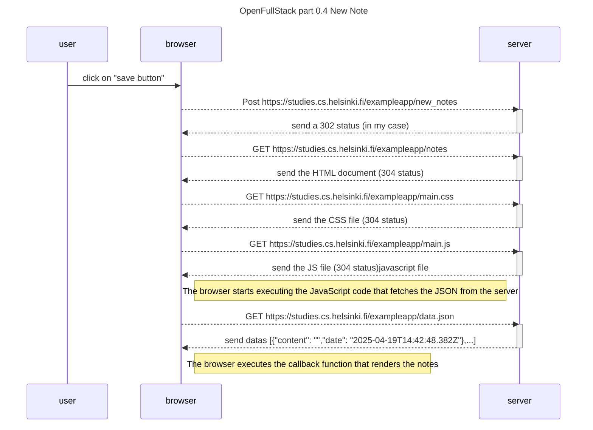

```mermaid

---
title: OpenFullStack part 0.4 New Note
---
   sequenceDiagram 
    participant user
    participant browser
    participant server


    user->>browser: click on "save button"

    browser-->>server: Post https://studies.cs.helsinki.fi/exampleapp/new_notes
    activate server 
    server-->>browser: send a 302 status (in my case)
    deactivate server
    
    browser-->>server: GET https://studies.cs.helsinki.fi/exampleapp/notes
    activate server 
    server-->>browser: send the HTML document (304 status)
    deactivate server

    browser-->>server: GET https://studies.cs.helsinki.fi/exampleapp/main.css
    activate server 
    server-->>browser: send the CSS file (304 status)
    deactivate server

    browser-->>server: GET https://studies.cs.helsinki.fi/exampleapp/main.js
    activate server 
    server-->>browser: send the JS file (304 status)javascript file
    deactivate server

    Note right of browser: The browser starts executing the JavaScript code that fetches the JSON from the server

    browser-->>server: GET https://studies.cs.helsinki.fi/exampleapp/data.json
    activate server 
    server-->>browser: send datas [{"content": "","date": "2025-04-19T14:42:48.382Z"},...]
    deactivate server

     Note right of browser: The browser executes the callback function that renders the notes


```