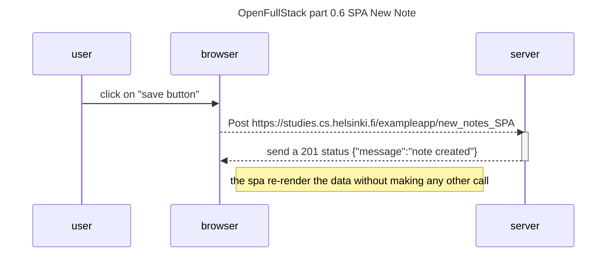

```mermaid

---
title: OpenFullStack part 0.6 SPA New Note
---
   sequenceDiagram 
    participant user
    participant browser
    participant server


    user->>browser: click on "save button"

    browser-->>server: Post https://studies.cs.helsinki.fi/exampleapp/new_notes_SPA
    activate server 
    server-->>browser: send a 201 status {"message":"note created"}
    deactivate server
    
    Note right of browser:  the spa re-render the data without making any other call 

```